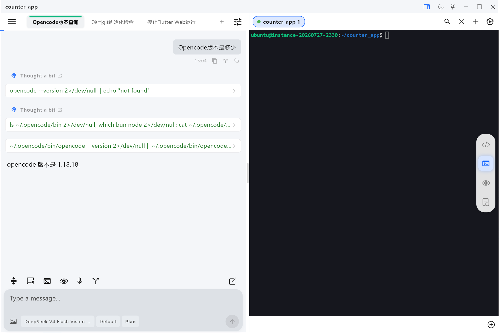

# OpenCode Mobile

<p align="center">
  <b>🖥️ Windows Desktop</b><br />
  
</p>

<div align="center">

| 📱 Phone UI | 💻 Tablet UI |
| :---: | :---: |
|  |  |

</div>

<p align="center">
  <b>English</b> | <a href="./README_CN.md">简体中文</a>
</p>

> [!WARNING]
> **UNOFFICIAL PROJECT** — This is an **unofficial** mobile and desktop client for OpenCode.

---

> [!IMPORTANT]
> If you cannot continue chatting in historical sessions, please update your OpenCode version immediately. If installed following [docs/server_en.md](./docs/server_en.md), run `sudo systemctl restart opencode` after upgrading.

---

Tokens are just way too expensive right now—can't even afford DeepSeek Flash anymore, so I decided to open-source this.

My Windows offline speech-to-text project is available on the Microsoft Store:
- Microsoft Store: https://apps.microsoft.com/detail/9pdf92ts07pf
- Documentation: https://owlmeeting.com/docs/en/
- Small support: Download the trial version and leave a good review
- Big support: You know what to do 😉

---

## 📱 About The Project

**OpenCode Mobile** is an **unofficial** client built with **Flutter** and **Rust** for OpenCode (supporting Android and Windows), providing versatile dual-backend connection options:
- **Self-Hosted Server**: Direct connection via HTTP/HTTPS to your own `opencode serve` backend instance (local machine, LAN server, WSL2, or VPS).
- **E2B Cloud Sandbox**: Deep integration with the [E2B](https://e2b.dev/) cloud sandbox platform (Website: https://e2b.dev ), spinning up instant cloud Linux development containers. New users receive **$100** in free credits!

Currently adapted for mobile, tablet, and Windows desktop devices:
- **Windows Desktop UI**: Frameless window with custom titlebar, Chrome/VS Code style multi-session tab bar (drag-and-drop reordering, mouse wheel scroll, middle-click to close), full keyboard & shortcut adaptations (Enter to send with IME protection, Shift+Enter for newline, Esc to abort), and clipboard image pasting.
- **Phone UI**: Clean and efficient single-column chat interface, with built-in quick phrases, terminal, file tree, and browser preview.
- **Tablet UI**: Dual-pane / multi-pane layout optimized for split-screen, maximizing wide screen utilization.

---

## 🛠️ Local Development & Build

### Prerequisites
- **Flutter SDK**: 3.38.5(Dart 3.10)
- **Rust**: 1.88 supported

### Common Commands
```bash
# Get dependencies
flutter pub get

cd rust
cargo build --release
```

### Notes
Most APIs are based on OpenCode v1. When this project was being written, there were issues with state control in the session APIs of the v2 version that couldn't be tuned properly. Not sure if those issues still exist now.

